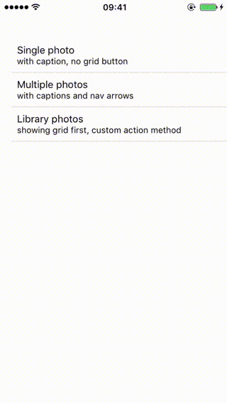
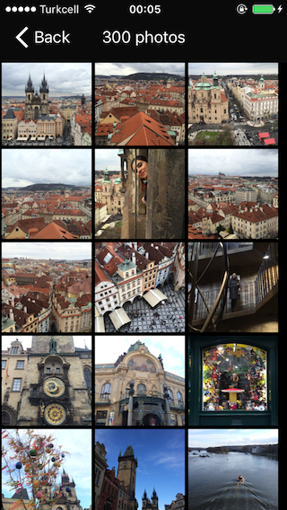

# React Native Photo Browser

A full screen image gallery with captions, selections and grid view support for react-native. Layout and API design are inspired by great [MWPhotoBrowser](https://github.com/mwaterfall/MWPhotoBrowser) library.

The component has both iOS and Android support.






### Installation 
```npm install react-native-photo-browser --save```

### Properties

| Prop | Type | Description | Default |
|---|---|---|---|
|**`style`**|Style|Overrides default container style.|`null`|
|**`mediaList`**|Array\<Media\>|List of [media objects](#media-object) to display.|`[]`|
|**`initialIndex`**|Number|Sets the visible photo initially.|`0`|
|**`alwaysShowControls`**|Boolean|Allows to control whether the bars and controls are always visible or whether they fade away to show the photo full.|`false`|
|**`displayActionButton`**|Boolean|Show action button to allow sharing, copying, etc.|`false`|
|**`displayNavArrows`**|Boolean|Whether to display left and right nav arrows on bottom toolbar.|`false`|
|**`alwaysDisplayStatusBar`**|Boolean|Whether to display the OS Status Bar.|`false`|
|**`displayTopBar`**|Boolean|Whether to display top bar.|`true`|
|**`enableGrid`**|Boolean|Whether to allow the viewing of all the photo thumbnails on a grid.|`true`|
|**`startOnGrid`**|Boolean|Whether to start on the grid of thumbnails instead of the first photo.|`false`|
|**`displaySelectionButtons`**|Boolean|Whether selection buttons are shown on each image.|`false`|
|**`useCircleProgress`**_iOS_|Boolean|Displays Progress.Circle instead of default Progress.Bar for full screen photos. Check [Progress](#progress-component) section for more info.|`false`|
|**`onSelectionChanged`**|Function|Called when a media item is selected or unselected.|`(media, index, isSelected) => {}`|
|**`onActionButton`**|Function|Called when action button is pressed for a photo. Your application should handle sharing process, please see [Sharing](#sharing) section for more information. If you don't provide this method, action button tap event will simply be ignored.|`(media, index) => {}`|
|**`onBack`**|Function|Called when back button is tapped.|`() => {}`|
|**`itemPerRow`**|Number|Sets images amount in grid row.|`3`|
|**`onPhotoLongPress`**|Function|Called when a long press trigged on a photo.|`() => {}`|
|**`delayPhotoLongPress`**|Number|The long press delay in `ms`.|`1000`|
|**`square`**|Boolean|Displays the thumbnails as squares(same width, height).|`false`|
|**`gridOffset`**|Number|Offset the width of the grid from the screen width.|`0`|

### Media Object

```js
const media = {
  thumb: '', // thumbnail version of the photo to be displayed in grid view. actual photo is used if thumb is not provided
  photo: '', // a remote photo or local media url
  caption: '', // photo caption to be displayed
  selected: true, // set the photo selected initially(default is false)
};
```


### Progress Component

#### Android

Built-in [ActivityIndicator](https://facebook.github.io/react-native/docs/activityindicator.html) component is used for Android. Any additional configuration is not needed.

#### iOS

[react-native-progress](https://github.com/oblador/react-native-progress) component is used as progress indicator. The default progress component is `Progress.Bar`. You can also use `Progress.Circle` component by simply using `useCircleProgress` prop, and adding `ReactART` library to your Xcode project. For more information please check out [react-native-progress repo](https://github.com/oblador/react-native-progress#reactart-based-components) and [React Native documentation](http://facebook.github.io/react-native/docs/linking-libraries-ios.html#content).

### Sharing

I tried delivering sharing photo feature but it was complicated to provide for iOS and android out of the box. I now believe it's a better idea to separate sharing logic into another module. Please check out Example project to see a basic ActionSheetIOS implementation for iOS. You may also use available sharing libraries such as [react-native-activity-view](https://github.com/naoufal/react-native-activity-view) and [react-native-share](https://github.com/EstebanFuentealba/react-native-share).

### Examples

See [PhotoBrowserExample.js](Example/PhotoBrowserExample.js) file.

Follow those steps to run the example:

1. Clone the repo `git clone https://github.com/halilb/react-native-photo-browser && cd react-native-photo-browser/Example`
2. Install dependencies `npm install`
3. Follow [official instructions](https://facebook.github.io/react-native/docs/getting-started.html) to run the example project in a simulator or device.

### Roadmap
- [x] Android support
- [ ] Improve performance for bigger collections
- [ ] Video support
- [ ] Photo zoom
- [ ] Zooming photos to fill the screen

### Licence
[MIT](http://opensource.org/licenses/mit-license.html)
